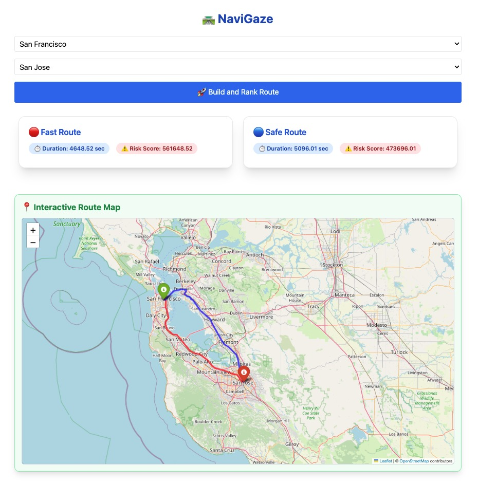

# NaviGaze

NaviGaze is an AI-enhanced route planning system that intelligently reranks driving routes by considering both travel time and safety. Instead of just suggesting the fastest path, NaviGaze adjusts route priorities based on **risk scores** calculated from **satellite imagery** analysis and **real-world context** (using YOLO object detection and LLM summarization). It aims to make navigation safer by detecting and avoiding high-risk areas such as blind spots, congestion, and poorly lit intersections.

---

## Project Structure

```
├── frontend/          # Frontend code (route visualization, Folium maps)
├── backend/           # Backend microservice for risk scores
│   ├── ranked_coords_list3.json  # Mock risk database
│   └── app.py         # Flask server
├── README.md          # This file
└── requirements.txt   # Shared dependencies (optional)
```

---

## Backend Setup (Risk Score Microservice)

1. **Navigate to backend directory:**
   ```bash
   cd backend/
   ```

2. **Create and activate a Python virtual environment:**
   ```bash
   python3 -m venv venv
   source venv/bin/activate  # Linux/Mac
   venv\Scripts\activate     # Windows
   ```

3. **Install required packages:**
   ```bash
   pip install flask
   ```

4. **Run the backend server:**
   ```bash
   python app.py
   ```
   - Server will start at `http://127.0.0.1:5000/`
   - It will expose an endpoint like `/get-risk?lat=...&lon=...` to fetch risk scores.

---

## Frontend Setup (Route Visualization)

1. **Navigate to frontend directory:**
   ```bash
   cd frontend/
   ```

2. **Ensure you have Python 3 installed.**

3. **Create and activate a virtual environment (recommended):**
   ```bash
   python3 -m venv venv
   source venv/bin/activate  # Linux/Mac
   venv\Scripts\activate     # Windows
   ```

4. **Install necessary packages:**
   ```bash
   pip install folium requests
   ```

5. **Frontend Behavior:**
   - The visualization is **embedded** in the frontend application.
   - Once the backend is running, simply **open or launch** the frontend app.
   - The app will **automatically call** the backend server to fetch risk scores.
   - It will **render the map dynamically** without requiring a manual script run.

---

## Important Notes

- Always **start the backend first**, then launch the frontend.
- If the backend server is not running, frontend will not be able to fetch risk scores.
- The project currently uses a **mock JSON risk database** (`ranked_coords_list3.json`) for testing.

---

## Example Commands to Run Everything From Scratch

```bash
# Backend
cd backend/
python3 -m venv venv
source venv/bin/activate
pip install flask
python app.py

# New terminal for frontend
cd frontend/
python3 -m venv venv
source venv/bin/activate
pip install folium requests
```

---

## System Architecture
<p align="center">
  
</p>
<p align="center">
  
</p>

## User Interface
<p align="center">
  
</p>


## Future Improvements

- Replace mock risk database with real-time satellite image analysis.
- Deploy backend as a microservice (e.g., FastAPI + Docker).
- Add frontend interactivity (click to view LLM-generated risk explanations).
- Integrate A* search dynamically adjusting paths based on live traffic risk updates.

